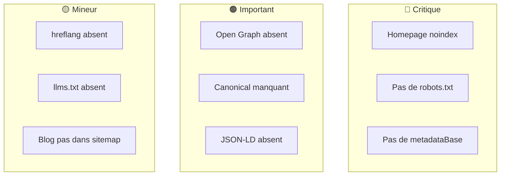

# Audit SEO/GEO

**Date**: 2024-03-20
**Statut**: Proposé

---

## Sommaire

1. [Problèmes critiques](#problèmes-critiques)
2. [Problèmes importants](#problèmes-importants)
3. [Internationalisation](#internationalisation)
4. [Référencement IA](#référencement-ia)
5. [Blog WordPress](#blog-wordpress)
6. [Ce qui fonctionne](#ce-qui-fonctionne)
7. [Récapitulatif](#récapitulatif)
8. [Annexe: Templates](#annexe-templates)

---

## Problèmes critiques

### Homepage non indexée

**Impact**: 🔴 Critique

La page d'accueil a `robots: { index: false, follow: false }`. Google ne peut pas l'indexer. Cela n'empêche pas l'indexation des autres pages, mais la homepage est la page la plus autoritaire (reçoit le plus de backlinks). Ne pas l'indexer réduit le "link juice" transmis au reste du site.

```typescript
// src/app/(public)/page.tsx - ligne 8
export const metadata: Metadata = {
  robots: { index: false, follow: false }, // ❌ Problème
}
```

### Pas de robots.txt

**Impact**: 🔴 Critique

Aucun fichier `robots.txt` n'existe. Les crawlers n'ont pas de directive claire. Les pages privées (`/administration`, `/bailleur`, `/mon-espace`) ne sont pas explicitement exclues du crawl.

```
# Résultat actuel
https://monlogementetudiant.beta.gouv.fr/robots.txt → 404
```

### Pas de metadataBase

**Impact**: 🔴 Critique

Sans `metadataBase` défini dans le layout racine, les URLs dans les metadata (canonical, og:url) sont relatives au lieu d'absolues. Google peut mal interpréter les URLs canoniques.

```typescript
// src/app/layout.tsx - metadataBase absent
export const metadata: Metadata = {
  title: '...',
  description: '...',
  // metadataBase: new URL('https://...') ← manquant
}
```

---

## Problèmes importants

### Open Graph / Twitter Cards absents

**Impact**: 🟠 Important

Aucun tag Open Graph ou Twitter Card n'est défini. Quand quelqu'un partage une page sur LinkedIn, Twitter ou Slack, l'aperçu est sous-optimal.

```
# Ce que LinkedIn voit actuellement
Titre: ✅ (infère depuis <title>)
Description: ✅ (infère depuis <meta description>)
Image: ❌ (prend la première image trouvée, souvent un logo)
```

### URLs canoniques manquantes

**Impact**: 🟠 Important

Une même page peut être accessible via plusieurs URLs. Google voit ça comme du contenu dupliqué.

```
# Ces 4 URLs montrent le même contenu
/trouver-un-logement-etudiant/ville/lyon
/trouver-un-logement-etudiant/ville/lyon?page=1
/trouver-un-logement-etudiant/ville/lyon?prix=800
/trouver-un-logement-etudiant/ville/lyon?page=1&prix=800&crous=true
```

Sans balise `<link rel="canonical">`, Google ne sait pas quelle URL privilégier.

### JSON-LD Schema absent

**Impact**: 🟠 Important

Pas de données structurées. Le site n'apparaît pas avec des rich snippets dans Google (prix, disponibilité, étoiles).

```
# Recherche Google actuelle
"résidence étudiante lyon" → Affichage basique (titre + description)

# Avec JSON-LD Apartment
"résidence étudiante lyon" → Prix affiché, disponibilité, photos
```

---

## Internationalisation

### hreflang manquant

**Impact**: 🟡 Mineur

Le site supporte FR et EN (traductions complètes dans `/messages/`) mais ne génère pas de tags `hreflang`. Un utilisateur anglophone qui cherche "student housing France" ne trouvera probablement pas le site.

```html
<!-- Tags manquants -->
<link rel="alternate" hreflang="fr" href="https://monlogementetudiant.fr/..." />
<link rel="alternate" hreflang="en" href="https://monlogementetudiant.fr/..." />
```

### URLs non localisées

**Impact**: 🟡 Mineur

Les URLs ne sont pas préfixées par la langue (`/fr/`, `/en/`). La langue est stockée dans un cookie. Google ne peut pas distinguer les versions linguistiques.

```
# Situation actuelle
monlogementetudiant.fr/trouver-un-logement → FR ou EN selon le cookie

# Idéal pour SEO multilingue
monlogementetudiant.fr/fr/trouver-un-logement → FR
monlogementetudiant.fr/en/find-housing → EN
```

---

## Référencement IA

### llms.txt absent

**Impact**: 🟡 Mineur

Le fichier `llms.txt` (standard 2024) aide les LLMs (ChatGPT, Perplexity, Claude) à comprendre un site. Plus structuré que crawler toutes les pages. Permet de contrôler le message.

```
# Résultat actuel
https://monlogementetudiant.beta.gouv.fr/llms.txt → 404
```

---

## Blog WordPress

Le blog est servi via **rewrite** dans `next.config.mjs`. Le contenu vient de `info.monlogementetudiant.beta.gouv.fr` mais l'URL reste sur le domaine principal. C'est transparent pour l'utilisateur et Google.

### Sitemap incomplet

**Impact**: 🟡 Mineur

Les pages `/preparer-sa-vie-etudiante/*` ne sont pas déclarées dans `sitemap.ts`. Google les découvre uniquement via les liens internes.

### Canonical potentiellement faux

**Impact**: 🟡 Mineur

Si WordPress déclare `<link rel="canonical" href="https://info.monlogementetudiant.beta.gouv.fr/...">`, Google est confus : deux URLs différentes pour le même contenu.

---

## Ce qui fonctionne

| Élément | Statut |
|---------|--------|
| Sitemap dynamique | ✅ Génère toutes les pages et logements |
| Metadata dynamiques | ✅ Titres et descriptions par page |
| Structure URLs | ✅ Claire et lisible (`/ville/lyon/residence-xxx`) |
| Breadcrumbs | ✅ Présents sur les pages détail |
| Maillage interne | ✅ Footer avec liens vers villes populaires |
| next/image | ✅ Images optimisées |
| Traductions | ✅ FR/EN complètes (921 lignes chacune) |

---

## Récapitulatif



### 🔴 Critique

| Problème | Fichier |
|----------|---------|
| Homepage noindex | `src/app/(public)/page.tsx` |
| Pas de robots.txt | `src/app/robots.ts` (à créer) |
| Pas de metadataBase | `src/app/layout.tsx` |

### 🟠 Important

| Problème | Fichier |
|----------|---------|
| Open Graph absent | `src/app/layout.tsx` + pages |
| Canonical manquant | Pages recherche/logements |
| JSON-LD absent | `src/app/layout.tsx` + pages |

### 🟡 Mineur

| Problème | Fichier |
|----------|---------|
| hreflang absent | `generateMetadata` |
| llms.txt absent | `public/llms.txt` (à créer) |
| Blog pas dans sitemap | `src/app/sitemap.ts` |

---

## Annexe: Templates

### robots.ts

```typescript
import { MetadataRoute } from 'next'

export default function robots(): MetadataRoute.Robots {
  return {
    rules: {
      userAgent: '*',
      allow: '/',
      disallow: ['/api/', '/administration/', '/bailleur/', '/mon-espace/'],
    },
    sitemap: 'https://monlogementetudiant.beta.gouv.fr/sitemap.xml',
  }
}
```

### Open Graph (dans generateMetadata)

```typescript
openGraph: {
  title: '...',
  description: '...',
  url: '...',
  siteName: 'Mon Logement Étudiant',
  locale: 'fr_FR',
  type: 'website',
  images: [{ url: '/images/og-default.jpg', width: 1200, height: 630 }],
},
twitter: {
  card: 'summary_large_image',
  title: '...',
  description: '...',
},
```

### Canonical URL

```typescript
export async function generateMetadata({ params }): Promise<Metadata> {
  return {
    alternates: {
      canonical: `https://monlogementetudiant.beta.gouv.fr/trouver-un-logement-etudiant/ville/${params.location}`,
    },
  }
}
```

### llms.txt

```
# Mon Logement Étudiant

## Description
Plateforme gouvernementale française (beta.gouv.fr) qui aide les étudiants
à trouver un logement. Agrège des résidences CROUS, bailleurs sociaux et privés.

## Pages principales
- /trouver-un-logement-etudiant - Recherche de logements par ville
- /simuler-mes-aides-au-logement - Simulateur d'aides CAF/APL
- /preparer-mon-budget-etudiant - Outil de budget

## Données disponibles
- 1300+ résidences étudiantes
- Couverture: France métropolitaine
- Prix: 200€ - 1500€/mois
- Sources: CROUS, ARPEJ, FAC Habitat, bailleurs privés

## Contact
contact@monlogementetudiant.beta.gouv.fr
```
