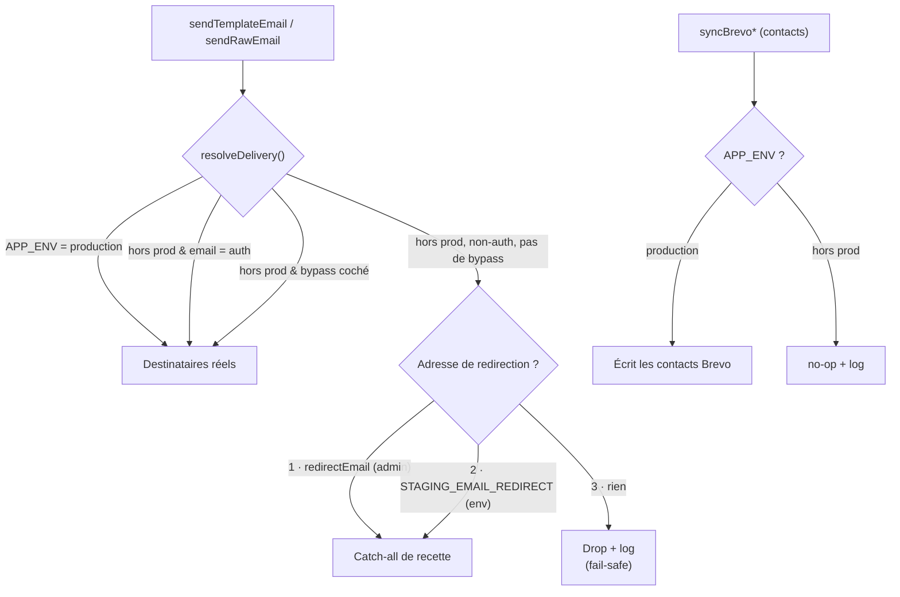

# ADR 0003 — Interception des emails hors production

Statut : accepté · Domaine : emails / environnements · Concerne tous les envois Brevo

## Contexte

Tous les emails de l'application partent via l'**API HTTP Brevo**, à travers deux
fonctions dans `src/server/services/brevo.ts` :

- `sendTemplateEmail()` — envois par template Brevo (la quasi-totalité) ;
- `sendRawEmail()` — envois en texte libre (notifications d'exploitation, tickets support).

En dehors de la production, les environnements peuvent atteindre de **vraies adresses** et
consommer les ressources d'envoi. Le besoin : pouvoir **recetter** les emails hors
production (notamment la campagne « parcours contact ») **sans jamais** toucher un vrai
compte, tout en gardant la possibilité de **se connecter aux espaces** pour les tests.

Une interception externe (type Mailpit ou autre catcheur SMTP) n'est pas adaptée ici : les
envois ne passent pas par SMTP mais par l'**API HTTP de Brevo**, et les templates sont
rendus côté Brevo — un catcheur n'afficherait donc pas l'email final et imposerait de
monter et maintenir une infrastructure dédiée. La protection est donc intégrée **dans le
code**, au niveau du transport.

Historiquement, elle reposait sur des gardes dispersées
(`if (NEXT_PUBLIC_APP_ENV !== 'production') return`) ajoutées au cas par cas dans
certaines fonctions. C'est fragile : chaque nouvel email doit penser à l'ajouter, et
plusieurs variantes coexistent avec une option `force` incohérente.

## Décision

On déplace la protection **au niveau du transport** (un point unique dans
`sendTemplateEmail` / `sendRawEmail`) plutôt que dans chaque appelant. Une seule
fonction pure, `resolveDelivery()`, décide du sort de chaque envoi.

### Verrou d'environnement

La fonctionnalité d'interception **n'existe qu'hors production**. En production,
`resolveDelivery()` renvoie toujours les destinataires réels : aucun comportement n'est
modifié, aucune configuration n'est lue. Le verrou s'applique donc **au niveau de l'API**,
pas seulement de l'interface d'administration.

### Les trois catégories d'envoi

| Catégorie | Hors production | Production |
|---|---|---|
| **`auth`** — magic link, validation d'email, réinitialisation de mot de passe, activation de compte | → **destinataire réel** (permet aux admins de se connecter aux espaces) | réel |
| **tout le reste** — campagne contacts, confirmations, notifications, **tickets support** | → **redirigé** vers l'adresse catch-all (ou réel si bypass) | réel |
| **synchronisation de contacts** (`syncBrevo*`, pas un email) | → **no-op** (ne pas écrire dans la base de contacts depuis un environnement de test) | réel |

### Résolution de l'adresse de redirection (le « point 4 »)

Hors production, pour un email **non-`auth`** et **sans bypass**, l'adresse de destination
est choisie dans cet ordre, en s'arrêtant à la première source disponible :

1. **Adresse configurée dans l'admin** (`redirectEmail`) ;
2. **sinon**, variable d'environnement `STAGING_EMAIL_REDIRECT` (utile en local / CI) ;
3. **sinon**, **drop + log** : l'email n'est envoyé à personne et l'événement est tracé.

Le défaut est donc **fail-safe** : en l'absence de toute configuration, rien ne part —
jamais d'envoi au destinataire réel par défaut.

### Paramétrage en administration

Une table de réglages (une seule ligne) expose deux champs, éditables **uniquement hors
production** par un administrateur (`adminProcedure`) :

- `redirectEmail` — l'adresse catch-all de recette ;
- `bypassRedirect` — une case à cocher qui **désactive** la redirection : les emails
  non-`auth` repartent alors vers leurs **destinataires réels**.

La case de bypass est un outil assumé pour les cas où l'on veut vérifier un envoi réel hors
production. Comme elle est confinée hors production, la production n'est jamais concernée.
L'interface affiche un **bandeau d'alerte** tant que le bypass est actif.

### Cas conservés tels quels

- **`sendStudentAlertEmail`** (cron `alert-sender`) garde sa garde `!== 'production'`
  existante. Ce flux est **non borné** (potentiellement des milliers de destinataires) et
  le rediriger en masse saturerait la catch-all **et** consommerait inutilement le quota
  d'envoi. Il n'est pas concerné par les besoins de recette actuels.
- La **volumétrie de recette** (campagne contacts, digests) est **maîtrisée par
  l'opérateur** via les données de test qu'il sème — pas par un plafond automatique.

## Conséquences

- Tout **nouvel email** est protégé **par construction** : il passe par le transport, donc
  par `resolveDelivery()`. Plus besoin d'ajouter une garde manuelle.
- Les gardes dispersées historiques peuvent être progressivement retirées au profit du
  point unique (hors `sendStudentAlertEmail`).
- La recette de la campagne contacts se fait hors production sans risque : les mails tombent
  dans la catch-all, la boîte support ne reçoit que les tickets de production.
- **Nouvelles variables d'environnement** : `STAGING_EMAIL_REDIRECT` (à déclarer dans
  `env.ts`, `.env.dist` et `vitest.config.ts`).

